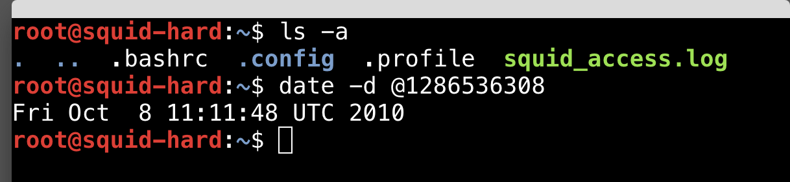

# Squid Proxy Log Analysis

## Objective

Analyze a Squid proxy access log to identify request timing, unique client IP addresses, HTTP request methods, and antivirus update activity. The project focused on using Linux command-line tools to extract specific information from `squid_access.log` and interpret the results.

### Skills Learned

- Analyzed Squid proxy logs from the Linux command line.
- Converted Unix timestamps into readable dates.
- Extracted and sorted specific log fields with `awk`.
- Counted unique client IP addresses and HTTP request methods.
- Identified antivirus-related network activity and update URLs.
- Practiced filtering and interpreting network log data.

### Tools Used

- Linux terminal
- `ls`
- `date`
- `awk`
- `sort`
- `head`
- `tail`
- `wc`
- `grep`

## Steps

### Step 1 - Locate the log and identify the year

The `ls -a` command confirmed that `squid_access.log` was available in the working directory. A Unix timestamp from the log was then converted with `date -d`, showing that the traffic was recorded in **2010**.

```bash
ls -a
date -d @1286536308
```



*Ref 1: The Squid access log was located and a Unix timestamp was converted to determine the year.*

---

### Step 2 - Find the fastest request

The second column of the Squid log contains the request duration in milliseconds. `awk` extracted that column, `sort -n` sorted the values numerically, and `head -1` returned the smallest value.

```bash
awk '{print $2}' squid_access.log | sort -n | head -1
```

The fastest request took **5 milliseconds**.


*Ref 2: The minimum request duration in the log was 5 milliseconds.*

---

### Step 3 - Find the longest request

The same request-duration column was sorted numerically, but `tail -1` was used to return the largest value.

```bash
awk '{print $2}' squid_access.log | sort -n | tail -1
```

The longest request took **41,762 milliseconds**.


*Ref 3: The maximum request duration in the log was 41,762 milliseconds.*

---

### Step 4 - Count unique client IP addresses

The third column contains the client IP address. The addresses were extracted, reduced to unique values, and counted.

```bash
awk '{print $3}' squid_access.log | sort -u | wc -l
```

The proxy log contained **4 unique client IP addresses**.


*Ref 4: The Squid log contained traffic from four different client IP addresses.*

---

### Step 5 - Count GET requests

`grep -c` was used to count lines containing the HTTP `GET` method.

```bash
grep -c ' GET ' squid_access.log
```

The log contained **35 GET requests**.


*Ref 5: The Squid log contained 35 GET requests.*

The same method was used for POST requests:

```bash
grep -c ' POST ' squid_access.log
```

The result was **78 POST requests**.

---

### Step 6 - Identify antivirus activity and the update URL

Traffic from client `192.168.0.224` showed requests to `liveupdate.symantecliveupdate.com` and a Norton virus-definitions ZIP file. This identified **Symantec** as the company associated with the antivirus traffic.

```bash
grep '192.168.0.224' squid_access.log
```

The antivirus update URL found in the log was:

```text
http://liveupdate.symantecliveupdate.com/streaming/norton%202009%20streaming%20virus%20definitions_1.0_symalllanguages_livetri.zip
```


*Ref 6: The log shows Norton/Symantec LiveUpdate traffic and the antivirus update download URL.*
